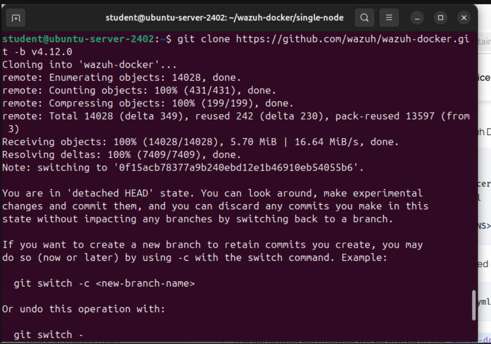
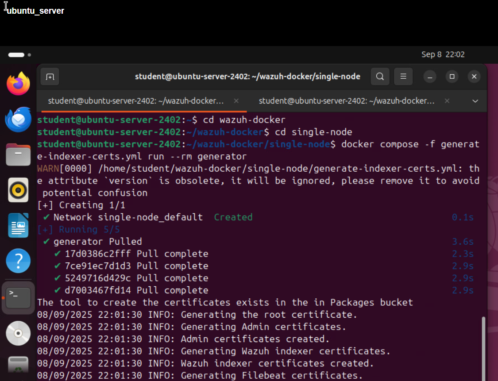
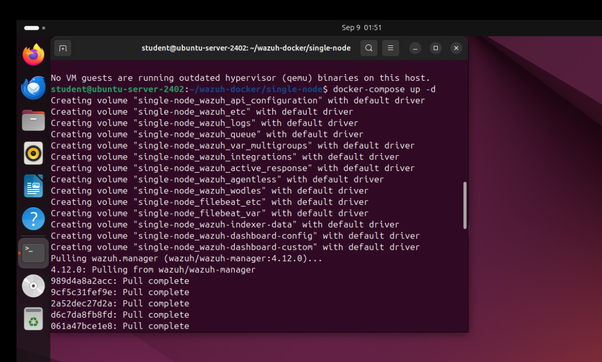
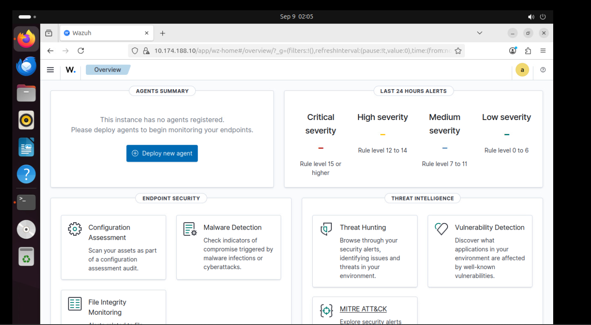
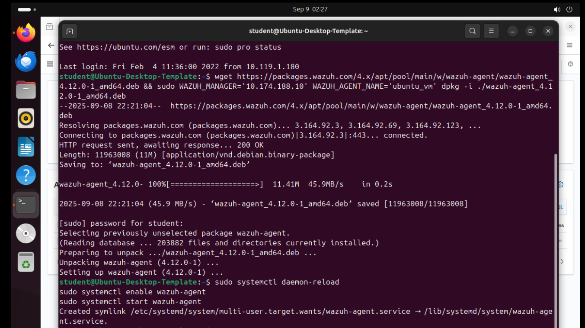
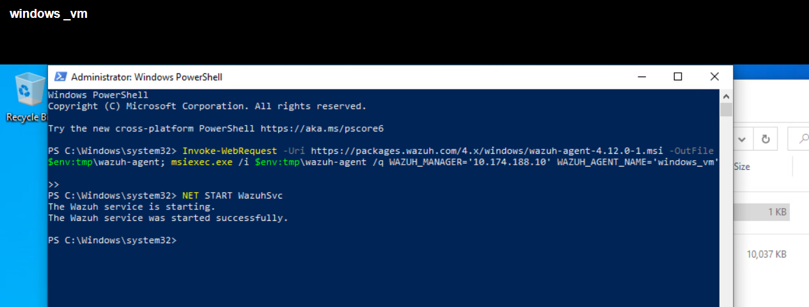
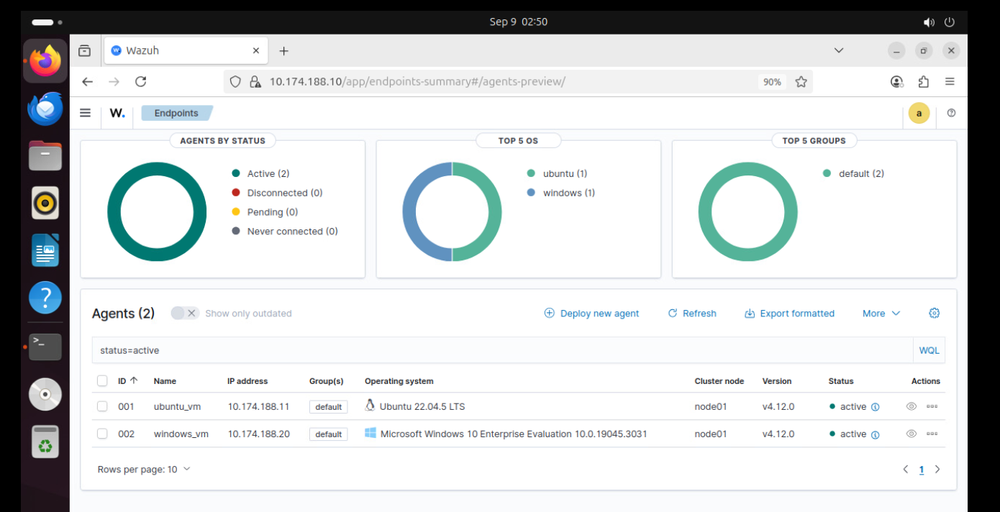
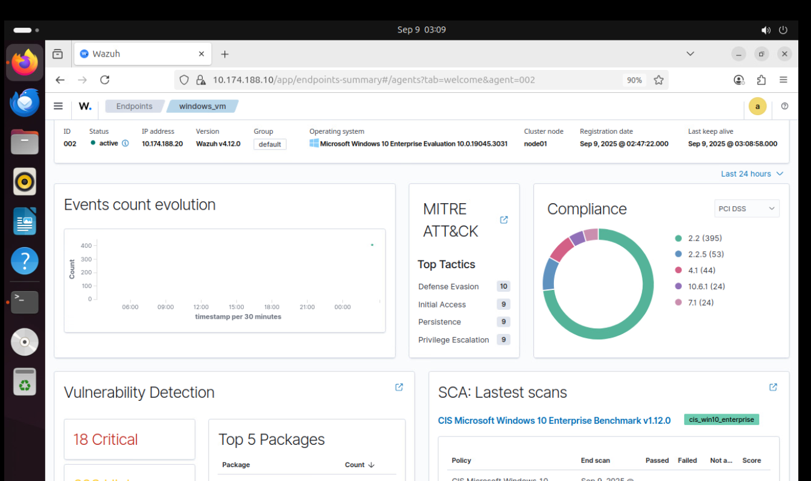
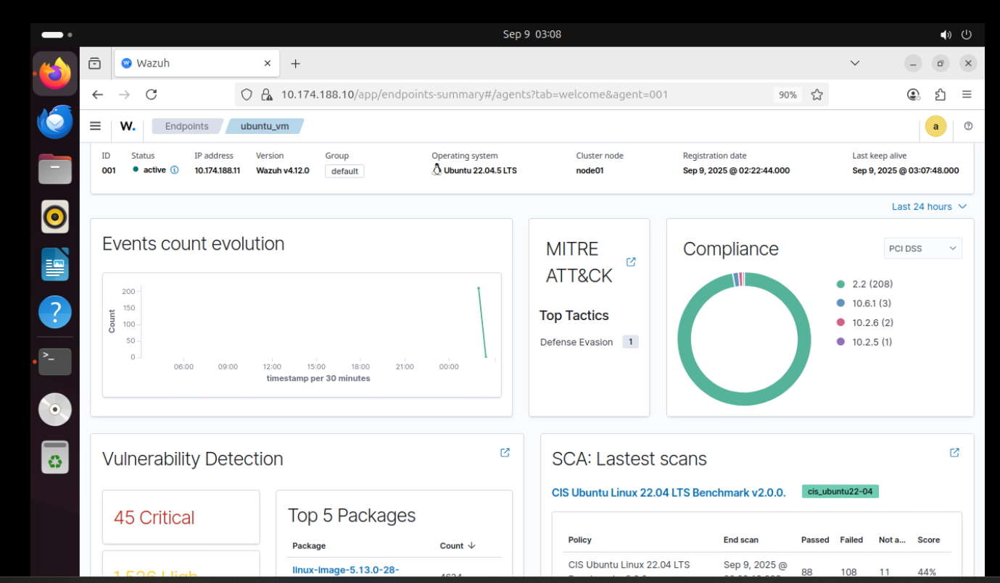

# Project: Wazuh SIEM Implementation with Docker Deployment

## Table of Contents
- [Overview](#overview)
- [Organizational Application](#organizational-application)
- [Configuration & Screenshots](#configuration--screenshots)
- [Observations and Challenges](#observations-and-challenges)
- [Reflections](#reflections)
- [How to Reproduce](#how-to-reproduce)

## Overview
This project demonstrates the implementation of Wazuh SIEM (Security Information and Event Management) using Docker containers for centralized security monitoring. The deployment includes a Wazuh manager server on Ubuntu Server (10.174.188.10) with agents deployed on Ubuntu VM (10.174.188.11) and Windows 10 VM (10.174.188.20), providing comprehensive security visibility across heterogeneous environments.

---

## Organizational Application

### Importance to Companies
Wazuh SIEM provides organizations with centralized security monitoring, enabling detection of threats, policy violations, and anomalous activities. It strengthens incident response capabilities and enhances compliance with organizational security policies.

### Use Case Scenario
A company needs to monitor multiple endpoints across Ubuntu and Windows systems for potential security threats. The Wazuh implementation provides:
- Centralized logging and alerting for multiple endpoints
- Real-time monitoring of Ubuntu and Windows systems
- Detection of unauthorized activities and suspicious events
- Compliance with security policies and regulatory requirements

### Security Benefits
- **Threat Detection**: Identifies security threats and anomalies across endpoints
- **Incident Response**: Facilitates faster investigation and mitigation of incidents
- **Policy Enforcement**: Ensures endpoint compliance with organizational security standards
- **Visibility**: Provides a unified dashboard for monitoring all connected agents

---

## Configuration & Screenshots

### 1. Wazuh Documentation Research
- Researched official Wazuh documentation to plan deployment

*Researching Wazuh deployment guides and best practices*

### 2. Docker Repository Cloning
- Cloned Wazuh Docker repository to local system

*Setting up Docker environment using Wazuh repository*

### 3. Certificate Generation
- Generated security certificates for manager-agent communication

*Secure communication certificates created for agents*

### 4. Initial Dashboard Access
- Accessed Wazuh dashboard to verify initial setup

*Confirming Wazuh manager deployment and dashboard availability*

### 5. Ubuntu Agent Installation
- Installed Wazuh agent on Ubuntu endpoint

*Ubuntu agent installation and registration with Wazuh manager*

### 6. Windows Agent Deployment
- Deployed Wazuh agent on Windows endpoint

*Windows agent installation and connectivity verification*

### 7. Agent Configuration Interface
- Configured agent settings and policies via Wazuh interface

*Centralized configuration interface for agent settings*

### 8. Agent Management Dashboard
- Verified agent connectivity and status in dashboard

*Managing all connected agents and monitoring health*

### 9. Windows Endpoint Monitoring
- Observed Windows endpoint logs and alerts in real-time

*Real-time monitoring and event detection for Windows endpoint*

### 10. Ubuntu Endpoint Monitoring
- Observed Ubuntu endpoint logs and alerts in real-time

*Real-time monitoring and event detection for Ubuntu endpoint*

---

## Observations and Challenges

### Technical Challenges
- **Certificate Management**: Ensuring secure certificate generation and distribution
- **Docker Networking**: Configuring Docker containers for proper network communication
- **Agent Compatibility**: Handling differences between Ubuntu and Windows agent setups

### Implementation Considerations
- **Scalability**: Planning deployment for multiple agents and endpoints
- **Resource Allocation**: Ensuring Docker containers have sufficient resources
- **Agent Management**: Maintaining configuration consistency across endpoints

### Operational Challenges
- **Real-Time Monitoring**: Ensuring all endpoint events are logged accurately
- **Alert Tuning**: Configuring rules to reduce false positives
- **Dashboard Visibility**: Managing and interpreting aggregated logs effectively

---

## Reflections

### Technical Learnings
- **Docker Deployment**: Gained expertise in containerized Wazuh deployment
- **Agent Configuration**: Learned detailed agent installation and setup on multiple OS
- **Endpoint Monitoring**: Enhanced skills in real-time log and alert analysis

### Security Insights
- **Threat Detection**: Improved understanding of cross-platform threat monitoring
- **Incident Response**: Learned to correlate alerts from multiple endpoints
- **Policy Enforcement**: Developed ability to enforce security policies via Wazuh

### Professional Development
- **Technical Documentation**: Improved ability to document deployment steps and screenshots
- **Problem-Solving**: Enhanced troubleshooting skills for cross-platform deployment
- **Best Practices**: Gained insight into security monitoring and SIEM management

---

## How to Reproduce

### Prerequisites
- Docker installed on central Wazuh manager host
- Ubuntu endpoint with network connectivity
- Windows endpoint with network connectivity
- Administrative privileges on all systems

### Step-by-Step Implementation

1. **Set Up Wazuh Manager**
```bash
# Clone Docker repository
git clone https://github.com/wazuh/wazuh-docker.git
cd wazuh-docker
# Launch manager container
docker-compose up -d
